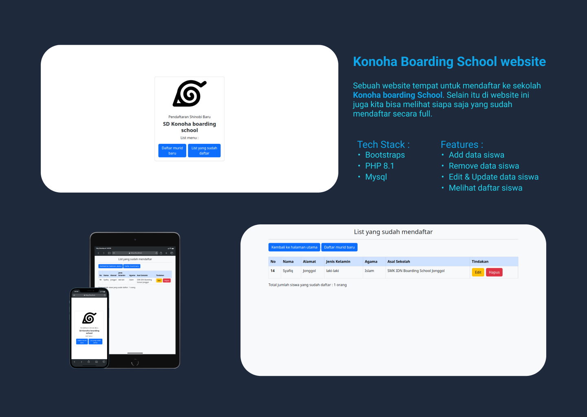

# Konoha Boarding School

## Deskripsi

Website Konoha School adalah sebuah website yang berisi tentang pendaftaran siswa dan list siswa yang sudah daftar di sekolah Konoha School. Website ini dibuat untuk memenuhi tugas kegabutan saya saja

## Teknologi yang di pakai

- HTML
- CSS
- Bootstraps
- PHP
- MySQL

## Fitur

- Tambah siswa
- Edit siswa
- Hapus siswa

## Cara menggunakan

1. Clone repository ini
2. Buat database dengan nama `konoha_school`
3. Import file `konoha_school.sql` ke database yang sudah dibuat
4. Jalankan server dengan perintah `php -S localhost:8000`
5. Buka browser dan ketikkan `localhost:8000`
